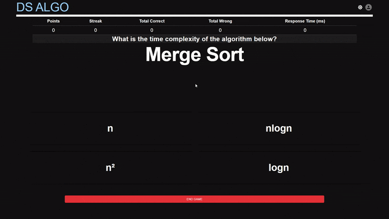
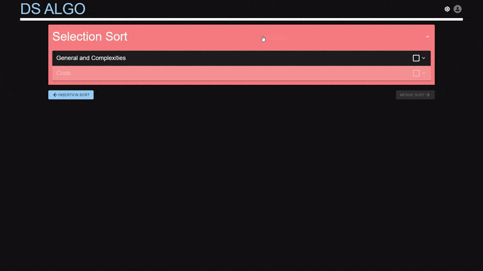
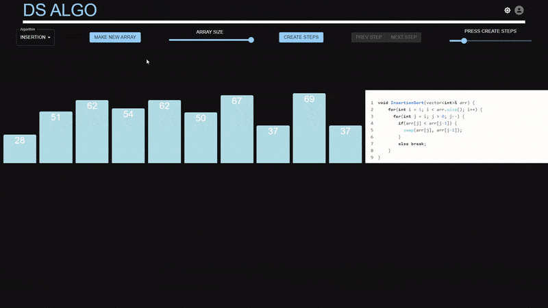

 
 
  <a href="https://dsalgo.arandeep.com" target="_blank" rel="noopener noreferrer">Visit the site here!<a>
 

# Data Structures and Sorting Algorithms Crash Course 

> ds_algo is an introductory crash course for fundamental data structures and sorting algorithms. 
> 
> It provides a variety of methods to interact and learn about the topics covered through sequential reading and an interactive quiz game.

## Topics Covered

### Data Structures

**Queues - Stack - Linked Lists - Binary Tree**

### Sorting Algorithms

**Insertion Sort - Selection Sort - Merge Sort - Quick Sort**

# Features

### Interactive Quiz Game

> Keep your skills sharp with a quiz game with 50+ randomly generated questions covering all sorting algorithm topics.
>
> Questions topics range from basic time and space complexity to interactive drag and drop. Each question is randomly generated and range in difficulty.

### Sequential Readings

> Learn about fundamental sorting algorithms and data structures through sequential reading sections and summary quizzes.
>
> Each topic covered has two reading sections and accompanying quizzes to reenforce the information covered. 

### Exploration Sandbox

> Explore sorting algorithms through visualizations and step-through code highlighting for a deeper understanding.

  

